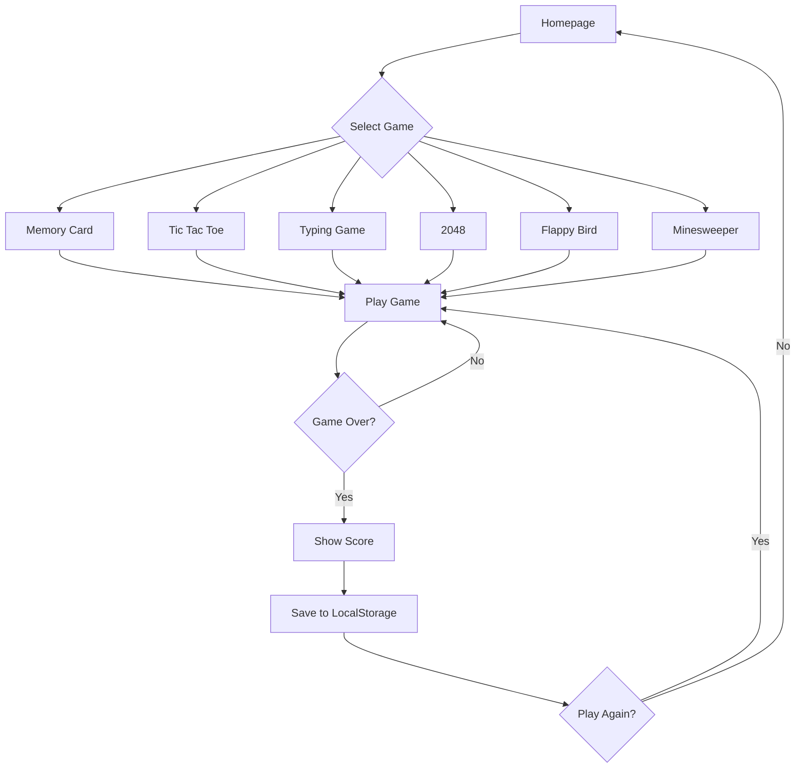

# Perencanaan Website Minigames dengan React + Vite

## 📋 Overview
Website collection dari 6 minigames klasik yang dibangun menggunakan React + Vite, tanpa backend (client-side only), dengan Shadcn UI untuk komponen dan Tailwind CSS untuk styling.

## 🎮 Daftar Games
1. **Memory Card** - Game mencocokkan kartu dengan memory
2. **Tic Tac Toe** - Game strategi klasik X vs O
3. **Typing Games** - Game mengetik untuk melatih kecepatan
4. **2048** - Puzzle game menggabungkan angka
5. **Flappy Bird** - Game arcade dengan physics
6. **Minesweeper** - Puzzle game dengan logic bombs

## 🏗️ Tech Stack

### Core
- **React 18+** - UI library
- **Vite** - Build tool & dev server (fast HMR)
- **TypeScript** - Type safety
- **React Router v6** - Client-side routing

### Styling & UI
- **Tailwind CSS** - Utility-first CSS framework
- **Shadcn UI** - High-quality React components
- **Lucide React** - Icons (dependency dari Shadcn)

### State Management
- **React Hooks** (useState, useEffect, useReducer)
- **Context API** - Untuk global state (theme, scores)

### Storage
- **LocalStorage** - Menyimpan high scores dan game state

### Utilities
- **clsx/cn** - Conditional classnames
- **date-fns** atau **dayjs** - Date formatting (optional)

## 📁 Struktur Folder

```
minigames/
├── public/
│   ├── favicon.ico
│   └── assets/
│       └── images/
├── src/
│   ├── components/
│   │   ├── ui/              # Shadcn UI components
│   │   │   ├── button.tsx
│   │   │   ├── card.tsx
│   │   │   ├── dialog.tsx
│   │   │   ├── badge.tsx
│   │   │   └── ...
│   │   ├── layout/
│   │   │   ├── Header.tsx
│   │   │   ├── Footer.tsx
│   │   │   └── GameCard.tsx
│   │   └── common/
│   │       ├── ScoreBoard.tsx
│   │       └── Timer.tsx
│   ├── games/
│   │   ├── memory-card/
│   │   │   ├── MemoryCard.tsx
│   │   │   ├── Card.tsx
│   │   │   └── useMemoryGame.ts
│   │   ├── tic-tac-toe/
│   │   │   ├── TicTacToe.tsx
│   │   │   ├── Board.tsx
│   │   │   ├── Square.tsx
│   │   │   └── useTicTacToe.ts
│   │   ├── typing-game/
│   │   │   ├── TypingGame.tsx
│   │   │   ├── WordDisplay.tsx
│   │   │   └── useTypingGame.ts
│   │   ├── game-2048/
│   │   │   ├── Game2048.tsx
│   │   │   ├── Grid.tsx
│   │   │   ├── Tile.tsx
│   │   │   └── use2048.ts
│   │   ├── flappy-bird/
│   │   │   ├── FlappyBird.tsx
│   │   │   ├── Bird.tsx
│   │   │   ├── Pipe.tsx
│   │   │   └── useFlappyBird.ts
│   │   └── minesweeper/
│   │       ├── Minesweeper.tsx
│   │       ├── Cell.tsx
│   │       └── useMinesweeper.ts
│   ├── pages/
│   │   ├── Home.tsx
│   │   ├── GamePage.tsx
│   │   └── NotFound.tsx
│   ├── hooks/
│   │   ├── useLocalStorage.ts
│   │   └── useGameScore.ts
│   ├── context/
│   │   ├── ThemeContext.tsx
│   │   └── ScoreContext.tsx
│   ├── lib/
│   │   └── utils.ts
│   ├── types/
│   │   └── index.ts
│   ├── App.tsx
│   ├── main.tsx
│   └── index.css
├── .gitignore
├── components.json        # Shadcn config
├── tailwind.config.js
├── tsconfig.json
├── vite.config.ts
└── package.json
```

## 🎯 Fitur Utama

### Homepage
- Grid/list menampilkan 6 games dengan thumbnail
- Setiap card game menampilkan:
  - Icon/preview game
  - Nama game
  - Deskripsi singkat
  - High score (jika ada)
  - Button "Play"
- Dark/Light mode toggle
- Responsive design (mobile-first)

### Fitur Global
- **Theme Toggle** - Dark/Light mode dengan Context
- **High Score System** - Simpan di localStorage
- **Sound Effects** - Optional toggle on/off
- **Responsive Layout** - Mobile, tablet, desktop
- **Navigation** - Header dengan logo dan back button

### Per Game Features

#### 1. Memory Card
- Grid kartu (4x4 atau 6x6)
- Flip animation
- Match detection
- Move counter
- Timer
- Win condition dengan confetti effect

#### 2. Tic Tac Toe
- 3x3 grid
- Player vs AI (minimax algorithm)
- Win/draw detection
- Reset game
- Score tracking
- Animation untuk winning line

#### 3. Typing Game
- Random kata/kalimat dari list
- Real-time WPM (Words Per Minute)
- Accuracy percentage
- Timer countdown
- Highlight correct/wrong characters
- Difficulty levels (easy, medium, hard)

#### 4. 2048
- 4x4 grid
- Swipe/arrow key controls
- Smooth tile merge animation
- Score calculation
- Undo move (optional)
- Win condition (2048 tile)
- Continue after win

#### 5. Flappy Bird
- Bird dengan gravity physics
- Pipe obstacles dengan random heights
- Collision detection
- Score counter
- Game over screen
- Restart button
- Smooth animations dengan requestAnimationFrame

#### 6. Minesweeper
- Configurable grid (beginner, intermediate, expert)
- First click always safe
- Number indicators
- Flag placing (right-click atau long-press)
- Auto-reveal empty cells
- Timer
- Win/lose conditions

## 🔄 Game Flow



## 🎨 Design Guidelines

### Color Scheme
- Primary: Blue/Purple gradient
- Secondary: Orange/Yellow untuk highlights
- Success: Green
- Danger: Red
- Neutral: Gray scale
- Background: White (light mode), Dark gray (dark mode)

### Typography
- Font: Inter atau Poppins dari Google Fonts
- Headings: Bold, large size
- Body: Regular, readable size
- Monospace untuk Typing Game

### Components Style
- Rounded corners (rounded-lg, rounded-xl)
- Subtle shadows untuk depth
- Smooth transitions dan animations
- Hover effects pada interactive elements
- Loading states untuk games

## 💾 Data Storage Structure

### LocalStorage Schema
```typescript
interface GameScore {
  gameId: string;
  score: number;
  timestamp: number;
  metadata?: {
    moves?: number;
    time?: number;
    accuracy?: number;
  };
}

interface StorageData {
  theme: 'light' | 'dark';
  soundEnabled: boolean;
  highScores: {
    memoryCard: GameScore[];
    ticTacToe: GameScore[];
    typing: GameScore[];
    game2048: GameScore[];
    flappyBird: GameScore[];
    minesweeper: GameScore[];
  };
}
```

## 🚀 Routing Structure

```typescript
const routes = [
  {
    path: '/',
    element: <Home />
  },
  {
    path: '/game/memory-card',
    element: <MemoryCard />
  },
  {
    path: '/game/tic-tac-toe',
    element: <TicTacToe />
  },
  {
    path: '/game/typing',
    element: <TypingGame />
  },
  {
    path: '/game/2048',
    element: <Game2048 />
  },
  {
    path: '/game/flappy-bird',
    element: <FlappyBird />
  },
  {
    path: '/game/minesweeper',
    element: <Minesweeper />
  },
  {
    path: '*',
    element: <NotFound />
  }
];
```

## 🎮 Game Logic Complexity

### Tingkat Kesulitan Implementasi
1. ⭐ **Easy**: Tic Tac Toe, Memory Card
2. ⭐⭐ **Medium**: Typing Game, Minesweeper
3. ⭐⭐⭐ **Hard**: 2048, Flappy Bird

### Key Algorithms

#### Memory Card
- Fisher-Yates shuffle untuk randomize cards
- State management untuk flipped cards
- Match checking logic

#### Tic Tac Toe
- Minimax algorithm untuk AI
- Win condition checking (rows, columns, diagonals)
- Game state management

#### Typing Game
- String comparison untuk accuracy
- WPM calculation: `(characters / 5) / (time in minutes)`
- Real-time character highlighting

#### 2048
- Grid manipulation (shift, merge)
- Tile movement dengan animation
- Game over detection (no valid moves)

#### Flappy Bird
- requestAnimationFrame untuk smooth animation
- Gravity dan jump physics
- Collision detection (AABB)

#### Minesweeper
- Grid generation dengan random mines
- Recursive reveal untuk empty cells
- Adjacent mines counting

## 📦 Dependencies

```json
{
  "dependencies": {
    "react": "^18.3.0",
    "react-dom": "^18.3.0",
    "react-router-dom": "^6.24.0",
    "class-variance-authority": "^0.7.0",
    "clsx": "^2.1.0",
    "tailwind-merge": "^2.3.0",
    "lucide-react": "^0.395.0",
    "canvas-confetti": "^1.9.3"
  },
  "devDependencies": {
    "@types/react": "^18.3.0",
    "@types/react-dom": "^18.3.0",
    "@vitejs/plugin-react": "^4.3.0",
    "typescript": "^5.4.0",
    "vite": "^5.3.0",
    "tailwindcss": "^3.4.0",
    "postcss": "^8.4.0",
    "autoprefixer": "^10.4.0",
    "eslint": "^8.57.0"
  }
}
```

## 🔧 Configuration Files

### [`vite.config.ts`](vite.config.ts)
```typescript
import { defineConfig } from 'vite'
import react from '@vitejs/plugin-react'
import path from 'path'

export default defineConfig({
  plugins: [react()],
  resolve: {
    alias: {
      '@': path.resolve(__dirname, './src'),
    },
  },
})
```

### [`tailwind.config.js`](tailwind.config.js)
```javascript
module.exports = {
  darkMode: ['class'],
  content: [
    './index.html',
    './src/**/*.{ts,tsx,js,jsx}',
  ],
  theme: {
    extend: {
      // Shadcn theming
    },
  },
  plugins: [require('tailwindcss-animate')],
}
```

### [`components.json`](components.json) - Shadcn Config
```json
{
  "$schema": "https://ui.shadcn.com/schema.json",
  "style": "default",
  "rsc": false,
  "tsx": true,
  "tailwind": {
    "config": "tailwind.config.js",
    "css": "src/index.css",
    "baseColor": "slate",
    "cssVariables": true
  },
  "aliases": {
    "components": "@/components",
    "utils": "@/lib/utils"
  }
}
```

## ✅ Checklist Implementasi

### Phase 1: Setup & Foundation
- [ ] Inisialisasi proyek Vite + React + TypeScript
- [ ] Setup Tailwind CSS
- [ ] Install dan konfigurasi Shadcn UI
- [ ] Setup React Router
- [ ] Buat struktur folder
- [ ] Setup ESLint & Prettier (optional)

### Phase 2: Core Components & Layout
- [ ] Buat Header component dengan navigation
- [ ] Buat Footer component
- [ ] Buat GameCard component untuk homepage
- [ ] Implementasi Theme Context (dark/light mode)
- [ ] Buat Homepage dengan grid games
- [ ] Setup LocalStorage hooks

### Phase 3: Game Development
- [ ] **Memory Card Game**
  - [ ] Grid layout
  - [ ] Card flip animation
  - [ ] Match logic
  - [ ] Timer dan move counter
  - [ ] Win screen
  
- [ ] **Tic Tac Toe**
  - [ ] Board dan Square components
  - [ ] Game logic (win detection)
  - [ ] AI dengan minimax
  - [ ] Reset functionality
  
- [ ] **Typing Game**
  - [ ] Word display
  - [ ] Input handling
  - [ ] WPM calculation
  - [ ] Accuracy tracking
  - [ ] Timer countdown
  
- [ ] **2048**
  - [ ] Grid system
  - [ ] Tile movement
  - [ ] Merge logic
  - [ ] Score calculation
  - [ ] Game over detection
  
- [ ] **Flappy Bird**
  - [ ] Bird component dengan physics
  - [ ] Pipe generation
  - [ ] Collision detection
  - [ ] Score system
  - [ ] Game loop dengan RAF
  
- [ ] **Minesweeper**
  - [ ] Grid generation
  - [ ] Mine placement
  - [ ] Cell reveal logic
  - [ ] Flag system
  - [ ] Win/lose conditions

### Phase 4: Features & Polish
- [ ] High score system untuk setiap game
- [ ] Sound effects (optional)
- [ ] Animations dan transitions
- [ ] Loading states
- [ ] Error boundaries
- [ ] Responsive design testing

### Phase 5: Testing & Deployment
- [ ] Cross-browser testing
- [ ] Mobile responsiveness testing
- [ ] Performance optimization
- [ ] Build untuk production
- [ ] Deploy ke hosting (Vercel/Netlify)

## 🚀 Deployment Options

### Recommended: Vercel
1. Push code ke GitHub
2. Import repository di Vercel
3. Auto-deploy setiap push ke main branch

### Alternative: Netlify
1. Push code ke GitHub
2. Connect repository di Netlify
3. Configure build command: `npm run build`
4. Publish directory: `dist`

### Manual: GitHub Pages
1. Install gh-pages: `npm install -D gh-pages`
2. Add scripts di package.json:
   ```json
   "predeploy": "npm run build",
   "deploy": "gh-pages -d dist"
   ```
3. Update vite.config.ts dengan base path
4. Run: `npm run deploy`

## 📝 Notes

- Semua data disimpan di browser (localStorage) - tidak ada backend
- High scores akan hilang jika localStorage di-clear
- Gunakan TypeScript untuk type safety
- Implement error boundaries untuk handle crashes
- Optimize re-renders dengan React.memo bila perlu
- Gunakan useCallback dan useMemo untuk performance
- Test di berbagai device dan browser

## 🎓 Learning Resources

- [React Docs](https://react.dev)
- [Vite Guide](https://vitejs.dev/guide/)
- [Shadcn UI](https://ui.shadcn.com)
- [Tailwind CSS](https://tailwindcss.com/docs)
- [React Router](https://reactrouter.com)

---

**Happy Coding! 🎮✨**
